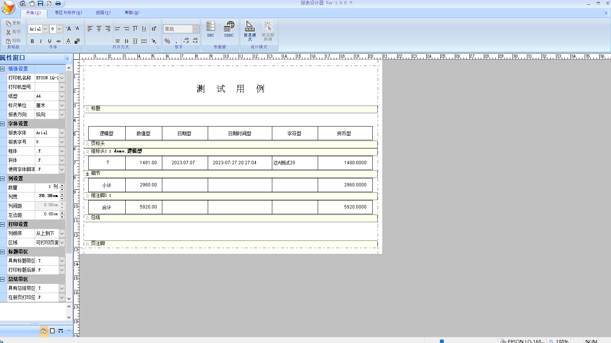

# VFP-OOP-Report-Designer
世界第一款完全面向对象的VFP报表设计器。



# 使用方法：
## 新建报表：
直接执行 ReportDesign.EXE

## VFP 中启动时打开已有报表：
#### 语法：
```foxpro
Do ReportDesign.EXE With [tcFrxName], [tnDesignMode], [tcSetDate], [tcCurrency], [tcSelect], [tcConnectionString]
```

#### 参数说明：
| 参数 | 描述                    |
|-------------------|--------------------------------|
|tcFrxName | 字符型，可选参数，需要打开的报表文件名 |
|tnDesignMode | 数值型，可选参数，设计模式，可选值：  1 - 报表模式；2 - 所见即所得 (值 2 暂时不支持)  |
|tcSetDate | 字符型，可选参数，报表需要使用的 Set([Date]) 值 |
|tcCurrency | 字符型，可选参数，报表需要使用的 Set("Currency", 1) 值 |
|tcSelect | 字符型，可选参数，与 tcFrxName 对应的数据源(dbf)列表或者 Select 语句（Select 语句暂时不支持） |
|tcConnectionString | 字符型，可选参数，可以建立远程连接的连接字符串（暂时不支持） |

#### 示例：
1. 数据源类型为 dbf
```foxpro
Do ReportDesign.EXE With "demo.frx", , , , "demo"			&& 数据源为单一 dbf
Do ReportDesign.EXE With "myreport.frx", , , , "master,slave"		&& 数据源为主从表，表格式为 dbf
```
2. 数据源为远程数据源（暂时不支持）
```foxpro
Do ReportDesign.EXE With "mytest.frx", , , , "Select Top 1 * From xxx", "Driver={SQL Server};Server=myServerAddress;Database=myDataBase;Uid=myUsername;Pwd=myPassword"
```
## 非 VFP 环境下调用：可使用 WINAPI 函数 ShellExecute 执行 ReportDesign.EXE

# 缘由：
VFP 固有的报表设计器，从 VFP3 已经定型了。至 VFP9，功能改进是有目共睹的，但复杂度也相应提高了不少。但是设计UI，几乎没有改变。对大多数 VFP 程序员来说，VFP 的报表设计器就是鸡肋。

2018年，我初次作为一个职业程序员在改动所在公司的软件架构时，遇到一个在当时状态下无法解决的问题，它一直遗留到我从该公司离职：

1. 在运行时，我找不到屏蔽某些影响程序运行的菜单，不是我的能力不够，是 VFP 根本没有提供（参看 SYS(2013) 或者 VFP 帮助中的“系统菜单名”一节）。这相当于在程序运行时如果提供修改/制作报表的功能时，给自己埋了一个不定时的炸弹，而且无法“拆除”！

2. 众所周知，VFP9 提供了一个新的报表引擎：90 。它所能实现的功能已开枝散叶，但是，必须在 ***SET REPORTBEHAVIOR 90**** 的环境下。恰恰是这个设置，造成在运行时修改/制作报表时，工具栏的显示状态会出现“花屏”现象，虽然有解，但解决方案丑陋到无法入目，如果软件本身为一个蛋糕，那么，这个解决方案就是蛋糕中裹着的一坨屎！

在 2019 年夏天的某个时刻，我忽然意识到以上所遇到问题的根本问题：VFP 报表设计器已经是“固化”到 VFP.EXE 里的，在 90 引擎下，在当时的开发团队的现实情况下，所谓的 90 引擎的报表设计，只能以外挂的方式来改进，但是它与 VFP UI，本质上是“分离”的。这是直接导致第 2 个问题的“罪魁祸首”。而第 1 个问题，几乎无解，或许你懂得反编译或汇编才可能有机会。

很感谢 Doug Hennig 提供了一个开源的项目：OOPReports（英文版 https://github.com/VFPX/OOPReports) (中文版 https://github.com/vfp9/OOPReports) 。它几乎就是个所谓的报表引擎！

我所需要实现的，就仅仅是将非可视对象，在UI中予以展现，并将所有的报表设计“结果”回写到非可视对象并使用“引擎”的保存方法就可以获得一个 FRX ！

我知道在设计原理上，它简单到只需上述的一句话就可以完整的说明设计思路。但在实现上，不知道有多少个坑在等着我去填......

我发起了一个所谓的众筹项目。

但是限于个人的私人情况，此项目至今才基本完成。

# 已实现设计目标：
1. 它是对象化的。

2. 它的使用是平滑替代 VFP 报表设计器，几乎无需另外学习。并且，提供了一个相对现代的设计UI。

3. 它在设计时报表是可缩放的，当然，也可以在缩放状态下进行设计，虽然后一个设计方法是我个人不建议的，因为在缩放状态下的设计，报表控件的定位会有可以理解的“偏差”。

4. 在设计报表时，更改“默认打印机”、更改纸张方向或者更改纸型，报表已有布局会自动调整而无需手工操作。

5. 它在一定程度上实现了所见即所得。

# 待实现的设计目标
1. 可以很方便的在报表设计时提供所谓“第三方”支持，例如条形码/二维码/图表等。

2. 报表的保护

3. 真正的所见即所得

# 更新历史
**2023.08.07**

版本：α1.0.17

修改：
1. 调整带区高度后拖拉增加控件报错；
2. 拖拉控件父节点至目标带区报错；
3. 支持以传参方式在EXE启动时打开指定的报表；
4. 运行时可以使用“打开”按钮切换报表(仅支持数据源为dbf的报表，且支持数据源为父子表)

**2023.08.07**

版本：α1.0.16

修改：
1. 控件切换后菜单的项的禁用状态不正确；
2. 修正一些小bug；
3. 菜单-开始-数字 重构完成。

**2023.08.06**

版本：α1.0.15

修改：
1. 控件对齐对话框；
2. 增加菜单项禁用图标。

**2023.08.05**

版本：α1.0.14

修改：
1. 菜单字体修改；
2. 菜单-开始-对齐方式 重构完成。

**2023.08.05**

版本：α1.0.13

修改：
1. 缩放状态下复制/剪切/粘贴后，恢复至100%时，字体大小不正确；
2. 选择控件后，菜单中的字体、字号显示错误；
3. 菜单-开始-字体 部分重构完成。

**2023.08.05**

版本：α1.0.12

修改：基本实现菜单的复制/剪切/粘贴。

**2023.08.04**

版本：α1.0.11

修改：
1. 软件某些情况下无法关闭；
2. 纸型、方向改变后某些控件无法自动调整；
3. 属性窗口中前景色设置错误；
4. 初步实现控件的复制/粘贴。

**2023.08.04**

版本：α1.0.10

修改：因上一版本的修改造成的点击菜单控件后添加控件时的异常。

**2023.08.04**

版本：α1.0.9

修改：点击带区空白区域不能在UI中展示正确的反应。

**2023.08.03**

版本：α1.0.8

修改：删除控件时的异常

**2023.08.02**

版本：α1.07

修改：对于文本框，当载入或者选择数据类型时，属性窗口相应无关控件被禁用。

**2023.08.02**

版本：α1.06

修改：UI缩放后强制重绘标尺。

**2023.08.02**

版本：α1.05

修改：当使用 Shape 作为表格边线时，在选择 Shape 后，可能会造成其他控件无法选择。

**2023.08.02**

版本：α1.04

修改：增加遗漏的图标文件

**2023.08.02**

版本：α1.03

修改：
1. 如果字体为可缩放的(支持连续字体大小值)，字号可选择范围为 4 - 127；
2. 修改属性窗口中某些控件，使之不能手工录入；
3. 更改字体或字号时属性窗口可能的异常行为。

**2023.08.02**

版本：α1.02

修改：

属性窗口的行为：

1. 点击属性窗口中的属性名，属性值选项控件可以立即获得焦点；
2. 在切换当前所选控件后，属性窗口中属性名如果存在，不再定位在行首。

**2023.08.02**

版本：α1.01

修改：增加遗漏的图标文件

**2023.08.01**

α1 测试版发布
