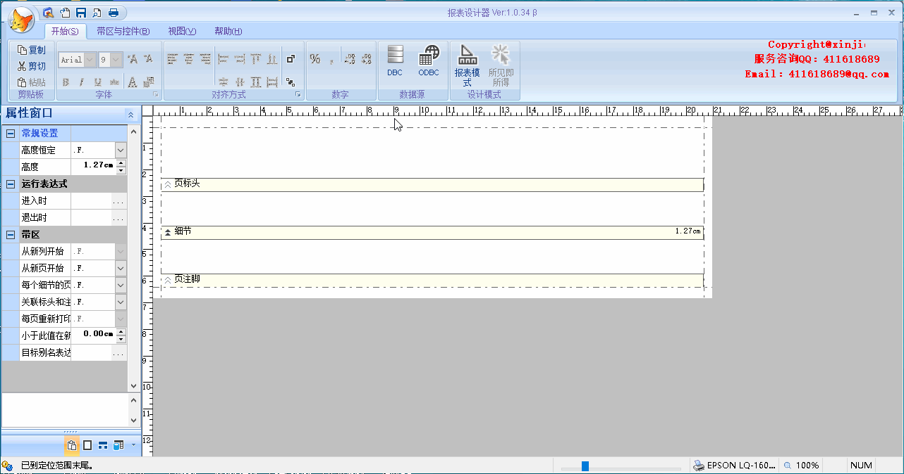

# VFP-OOP-Report-Designer
世界第一款完全面向对象的VFP报表设计器。

**开发语言及版本：** VFP9 SP2 7423

**OS:** WIN10 21H2

**应用环境：** 可独立使用，亦可在程序语言（**包括但不限于** VFP、VB6、VC++、VB.NET、C#等）中进行调用用以制作或修改报表。换句话说，**可以执行 32 位可执行程序并传递相关参数的语言均可使用**。

**报表存储格式：** **frx**(VFP语言特有的报表格式，本质仍旧是一个dbf)

**报表输出格式：** 使用第三方的 FoxyPreviewer,支持输出：
1. 图片(PNG/BMP/JPG/GIF/TIF/EMF)
2. PDF
3. WORD(RTF/DOC)
4. EXCEL(XLS/XML)
5. HTML(HTM/HTML)
6. MHTML(MHT/MHTML)

**报表数据源：** dbf 或者可以通过 ODBC/OLE DB 连接的关系数据库（例如 SQL Server/MySQL），JSON/XML 格式的数据源将列入开发计划，敬请期待！



# 使用方法：
## 新建报表：
直接执行 ReportDesign.EXE

## 启动 EXE 时打开已有报表：
#### 参数说明：
| 参数 | 描述                    |
|-------------------|--------------------------------|
|tcFrxName | 字符型，可选参数，需要打开的报表文件名 |
|tcCursorList | 字符型，可选参数，与 tcFrxName 对应的数据源列表，cursor 暂不支持！(dbf   注：可以带路径，包括相对路径，表以共享方式打开) |
|tcSelect | 字符型，可选参数，与 tcFrxName 对应的用于生成 Cursor 的 Select 语句（暂时不支持） |
|tcConnectionString | 字符型，可选参数，可以建立远程连接的连接字符串（暂时不支持） |
|tnDesignMode | 数值型，可选参数，设计模式，可选值：  1 - 报表模式；2 - 所见即所得 (值 2 暂时不支持)  |
|tcSetDate | 字符型，可选参数，报表需要使用的 Set([Date]) 值 |
|tcCurrency | 字符型，可选参数，报表需要使用的 Set("Currency", 1) 值 |

#### 示例：
1. 数据源类型为 dbf
   
**VFP 的调用方式：**
```foxpro
Private lnReturn, lpszDir, lpszFile, lpszOpen, lpszParams, fsShowCMD, HWnd
Local lnReturn As Number, lpszDir As Character,	lpszFile As Character, lpszOpen As Character, lpszParams As Character, fsShowCMD As Number, HWnd As Number

Declare Integer ShellExecute In shell32.Dll Integer, STRING, String, String, STRING, Integer
Declare Integer GetDesktopWindow IN win32api

m.HWnd = GetDesktopWindow()

m.lpszOpen		= [open]
m.lpszFile		= [ReportDesign.exe]
m.lpszParams	= []

*!* 传入多个参数，用空格分隔，如果路径中有空格，使用双引号。
*!*	m.lpszParams	= [".\Reports\demo2.frx" ".\data\demo.dbf"]		&& 相对路径
*!*	m.lpszParams	= ["C:\VFP ReportDesign\Reports\demo2.frx" "C:\VFP ReportDesign\data\demo.dbf"]		&& 绝对路径

m.lpszDir		= Sys(5) + Sys(2003)
m.fsShowCMD		= 0
m.lnReturn		= ShellExecute(m.HWnd, m.lpszOpen, m.lpszFile, m.lpszParams, m.lpszDir, m.fsShowCMD)
```
**VB6 的调用方式：**
```basic
Private Declare Function ShellExecute Lib "shell32.dll" Alias "ShellExecuteA" _
    (ByVal hwnd As Long, ByVal lpOperation As String, ByVal lpFile As String, _
    ByVal lpParameters As String, ByVal lpDirectory As String, ByVal nShowCmd As Long) As Long

Private Declare Function GetDesktopWindow Lib "user32" () As Long


Private Sub Command1_Click()
    ' 定义返回值变量
    Dim RetVal As Long
    ' 定义 EXE 文件路径
    Dim exePath As String
    ' 定义参数
    Dim parameters As String
    ' 定义 EXE 文件所在目录
    Dim exeDirectory As String

    ' 设置 EXE 文件路径
    exePath = "reportdesign.exe"
    ' 设置 EXE 文件所在目录
    exeDirectory = "C:\VFP ReportDesign"

    parameters = ""
    
    ' 设置参数，参数中的路径是相对于 EXE 文件所在目录的
    ' parameters = """reports\demo2.frx"" ""data\demo.dbf"""
    
    ' 设置参数，参数中使用绝对路径
    ' parameters = """C:\VFP ReportDesign\reports\demo2.frx"" ""C:\VFP ReportDesign\data\demo.dbf"""


    ' 调用 ShellExecute 函数执行 EXE 文件
    RetVal = ShellExecute(GetDesktopWindow(), "open", exePath, parameters, exeDirectory, 1)
End Sub
```
**VC++ 的调用方式：**
```c
#include <windows.h>
#include <shellapi.h>

// WinMain 函数，Windows应用程序的入口点
int WINAPI WinMain(HINSTANCE hInstance, HINSTANCE hPrevInstance, LPSTR lpCmdLine, int nCmdShow)
{
    // 定义返回值变量
    HINSTANCE RetVal;
    // 定义 EXE 文件路径
    LPCSTR exePath = "reportdesign.exe";
    // 定义参数
    LPCSTR parameters = "";
	// LPCSTR parameters = "reports\\demo2.frx data\\demo.dbf";
	// LPCSTR parameters = "\"C:\\VFP ReportDesign\\Reports\\demo2.frx\" \"C:\\VFP ReportDesign\\data\\demo.dbf\"";

    // 定义 EXE 文件所在目录
    LPCSTR exeDirectory = "C:\\VFP ReportDesign";

    // 调用 ShellExecute 函数执行 EXE 文件
    RetVal = ShellExecute(NULL, "open", exePath, parameters, exeDirectory, SW_SHOW);

    return 0;
}
```
**VB.NET 的调用方式：**
```vbnet
Imports System.Diagnostics

Public Class Form1
    Private Sub Button1_Click(sender As Object, e As EventArgs) Handles Button1.Click
        ' 定义 EXE 文件路径
        Dim exePath As String = "reportdesign.exe"
        ' 定义 EXE 文件所在目录
        Dim exeDirectory As String = "C:\VFP ReportDesign"
        ' 定义参数，不传递任何参数
        Dim parametersRelative As String = ""
        ' 定义参数，使用相对路径
        ' Dim parametersRelative As String = """Reports\demo2.frx"" ""data\demo.dbf"""
        ' 定义参数，使用绝对路径
        ' Dim parametersAbsolute As String = """C:\VFP ReportDesign\Reports\demo2.frx"" ""C:\VFP ReportDesign\data\demo.dbf"""

        ' 创建 ProcessStartInfo 对象
        Dim startInfo As New ProcessStartInfo(exePath)

        ' 设置工作目录为 EXE 文件所在目录
        startInfo.WorkingDirectory = exeDirectory

        ' 使用相对路径执行 EXE 文件
        startInfo.Arguments = parametersRelative
        Process.Start(startInfo)

        ' 使用绝对路径执行 EXE 文件
        ' startInfo.Arguments = parametersAbsolute
        ' Process.Start(startInfo)
    End Sub
End Class
```
**C# 的调用方式：**
```csharp
using System;
using System.Collections.Generic;
using System.ComponentModel;
using System.Data;
using System.Drawing;
using System.Linq;
using System.Text;
using System.Threading.Tasks;
using System.Windows.Forms;
using System.Diagnostics;

namespace demo
{
    public partial class Form1 : Form
    {
        public Form1()
        {
            InitializeComponent();
        }

        private void button1_Click(object sender, EventArgs e)
        {
            // 定义 EXE 文件路径
            string exePath = @"C:\VFP ReportDesign\reportdesign.exe";
            // 定义 EXE 文件所在目录
            string exeDirectory = @"C:\VFP ReportDesign";
            // 定义参数，无参数
            string parametersRelative = @"";
            // 定义参数，使用相对路径
            // string parametersRelative = @"""Reports\demo2.frx"" ""data\demo.dbf""";
            // 定义参数，使用绝对路径
            // string parametersAbsolute = @"""C:\VFP ReportDesign\Reports\demo2.frx"" ""C:\VFP ReportDesign\data\demo.dbf""";

            // 创建 ProcessStartInfo 对象
            ProcessStartInfo startInfo = new ProcessStartInfo(exePath);

            // 设置工作目录为 EXE 文件所在目录
            startInfo.WorkingDirectory = exeDirectory;

            // 使用相对路径执行 EXE 文件
            startInfo.Arguments = parametersRelative;
            Process.Start(startInfo);

            // 使用绝对路径执行 EXE 文件
            // startInfo.Arguments = parametersAbsolute;
            // Process.Start(startInfo);
        }
    }
}

```

## 可选组件为 FoxyPreviewer 。如需使用，解压 FoxyPreviewer.rar 即可(ver:v299z38)。也可将最新版本的 FoxyPreviewer 置于文件夹中。

# 缘由：
VFP 固有的报表设计器，从 VFP3 已经定型了。至 VFP9，功能改进是有目共睹的，但复杂度也相应提高了不少。但是设计UI，几乎没有改变。对大多数 VFP 程序员来说，VFP 的报表设计器就是鸡肋。

2018年，我初次作为一个职业程序员在改动所在公司的软件架构时，遇到一个在当时状态下无法解决的问题，它一直遗留到我从该公司离职：

1. 在运行时，我找不到屏蔽某些影响程序运行的菜单，不是我的能力不够，是 VFP 根本没有提供（参看 SYS(2013) 或者 VFP 帮助中的“系统菜单名”一节）。这相当于在程序运行时如果提供修改/制作报表的功能时，给自己埋了一个不定时的炸弹，而且无法“拆除”！

2. 众所周知，VFP9 提供了一个新的报表引擎：90 。它所能实现的功能已开枝散叶，但是，必须在 ***SET REPORTBEHAVIOR 90**** 的环境下。恰恰是这个设置，造成在运行时修改/制作报表时，工具栏的显示状态会出现“花屏”现象，虽然有解，但解决方案丑陋到无法入目，如果软件本身为一个蛋糕，那么，这个解决方案就是蛋糕中裹着的一坨屎！

在 2019 年夏天的某个时刻，我忽然意识到以上所遇到问题的根本问题：VFP 报表设计器已经是“固化”到 VFP.EXE 里的，在 90 引擎下，在当时的开发团队的现实情况下，所谓的 90 引擎的报表设计，只能以外挂的方式来改进，但是它与 VFP UI，本质上是“分离”的。这是直接导致第 2 个问题的“罪魁祸首”。而第 1 个问题，几乎无解，或许你懂得反编译或汇编才可能有机会。

很感谢 Doug Hennig 提供了一个开源的项目：OOPReports（英文版 https://github.com/VFPX/OOPReports) (中文版 https://github.com/vfp9/OOPReports) 。它几乎就是个所谓的报表引擎！

我所需要实现的，就仅仅是将非可视对象，在UI中予以展现，并将所有的报表设计“结果”回写到非可视对象并使用“引擎”的保存方法就可以获得一个 FRX ！

我知道在设计原理上，它简单到只需上述的一句话就可以完整的说明设计思路。但在实现上，不知道有多少个坑在等着我去填......

我发起了一个所谓的众筹项目。

但是限于个人的私人情况，此项目至今才基本完成。

# 已实现设计目标：
1. 它是对象化的。

2. 它的使用是平滑替代 VFP 报表设计器，几乎无需另外学习。并且，提供了一个相对现代的设计UI。

3. 它在设计时报表是可缩放的，当然，也可以在缩放状态下进行设计，虽然后一个设计方法是我个人不建议的，因为在缩放状态下的设计，报表控件的定位会有可以理解的“偏差”。

4. 在设计报表时，更改“默认打印机”、更改纸张方向或者更改纸型，报表已有布局会自动调整而无需手工操作。

5. 它在一定程度上实现了所见即所得。

# 待实现的设计目标
1. 可以很方便的在报表设计时提供所谓“第三方”支持，例如条形码/二维码/图表等。

2. 报表的保护

3. 真正的所见即所得

# 更新历史  
**2023.08.18**

版本：β1.0.34

修改：
1. 缩放状态下调整控件尺寸时结果不正确；
2. “表格”调整高度时，“单元格”内部的标签和文本框自动居中；
2. 某种情况下，调整“表格”行高程序报错。

**2023.08.18**

版本：β1.0.33

修改：缩放状态下添加“表格”在 UI 上呈现位置不正确

**2023.08.17**

版本：β1.0.32

**重要修改**：执行 EXE 时增加可选参数 tcCursorList 并调整参数顺序

其他修改：
1. 支持带路径的参数，参看示例；
2. 传入的 dbf 如果不能被以共享方式打开，程序提供错误信息并直接退出；
3. 通过快速菜单打开报表时，如果指定的 dbf （可以不在 EXE 所在目录或者其子目录中）不能被以共享方式打开，程序会打开默认的报表模板而不是指定的报表
   
**2023.08.16**

版本：β1.0.31

修改：
1. 字段拖放至带区时，文本框的表达式属性不正确
2. 文本框指定其表达式属性时如果表不存在程序异常

**2023.08.16**

版本：β1.0.30

增加：
1. 在 about 表单中增加网址
2. 当移动 shape 时，其“内部”控件同步移动，其他带区的表体同步移动。
3. 优化“表格”内控件可以多选时在“单元格”中设置水平居中或垂直居中
   
**2023.08.15**

版本：β1.0.29

增加：版权信息和致谢名单

**2023.08.15**

版本：β1.0.28

修改：
1. 优化选择多个控件后使用键盘移动所选控件时的迟滞感
2. 如果“表头”移动，则不同带区的“表体”同步移动

增加：
1. 控件在页面布局中的水平居中和垂直居中
2. 一键添加一行N列的表格

**2023.08.14**

版本：β1.0.27

修改：集成报表的 90 引擎

**2023.08.14**

版本：α1.0.26

修改：
1. 修正带区高度。

新增：
1. 调整 shape 的高度时，自动调整“内部”竖线的高度。
2. 
**2023.08.14**

版本：α1.0.25

修改：
1. 禁止重复打开相同的报表文件；
2. 打印预览硬编码造成的只能预览示例报表；
3. 分组表达式为空时，保存的FRX预览和打印时提示文件无效；
4. 对象复制/剪切/粘贴后的结果，默认背景色属性不正确。
5. 对象复制/剪切/粘贴后，打印位置可能错误。
6. 对象复制/剪切/粘贴后，FontBold 错误。

**2023.08.13**

版本：α1.0.24

修改：
1. 连续预览报错
2. 连续增减细节带区报错
3. 属性窗口细节带区数量不正确
4. 增减细节带区并保存。在再次载入FRX时，UI报错且呈现结果不正确。
   
**2023.08.12**

版本：α1.0.23

修改：保存或预览后，选择控件时属性窗口内容不变。

**2023.08.11**

版本：α1.0.22

新增：保持、预览初步完成。

**2023.08.11**

版本：α1.0.21

新增：移动某条垂直线条时，不同带区同一位置竖线同步移动。

**2023.08.10**

版本：α1.0.20

修改：点击菜单中的控件后，保持按钮高亮状态

**2023.08.09**

版本：α1.0.19

修改：
1. 上一版本造成的控件粘贴错误；
2. 一些小bug

**2023.08.09**

版本：α1.0.18

新增：
1. 菜单-开始-数据源-DBC
2. 侧边面板新增“数据源”，允许从其中直接拖拽字段至带区

修改：一些小bug

**2023.08.07**

版本：α1.0.17

修改：
1. 调整带区高度后拖拉增加控件报错；
2. 拖拉控件父节点至目标带区报错；
3. 支持以传参方式在EXE启动时打开指定的报表；
4. 运行时可以使用“打开”按钮切换报表(仅支持数据源为dbf的报表，且支持数据源为父子表)

**2023.08.07**

版本：α1.0.16

修改：
1. 控件切换后菜单的项的禁用状态不正确；
2. 修正一些小bug；
3. 菜单-开始-数字 重构完成。

**2023.08.06**

版本：α1.0.15

修改：
1. 控件对齐对话框；
2. 增加菜单项禁用图标。

**2023.08.05**

版本：α1.0.14

修改：
1. 菜单字体修改；
2. 菜单-开始-对齐方式 重构完成。

**2023.08.05**

版本：α1.0.13

修改：
1. 缩放状态下复制/剪切/粘贴后，恢复至100%时，字体大小不正确；
2. 选择控件后，菜单中的字体、字号显示错误；
3. 菜单-开始-字体 部分重构完成。

**2023.08.05**

版本：α1.0.12

修改：基本实现菜单的复制/剪切/粘贴。

**2023.08.04**

版本：α1.0.11

修改：
1. 软件某些情况下无法关闭；
2. 纸型、方向改变后某些控件无法自动调整；
3. 属性窗口中前景色设置错误；
4. 初步实现控件的复制/粘贴。

**2023.08.04**

版本：α1.0.10

修改：因上一版本的修改造成的点击菜单控件后添加控件时的异常。

**2023.08.04**

版本：α1.0.9

修改：点击带区空白区域不能在UI中展示正确的反应。

**2023.08.03**

版本：α1.0.8

修改：删除控件时的异常

**2023.08.02**

版本：α1.07

修改：对于文本框，当载入或者选择数据类型时，属性窗口相应无关控件被禁用。

**2023.08.02**

版本：α1.06

修改：UI缩放后强制重绘标尺。

**2023.08.02**

版本：α1.05

修改：当使用 Shape 作为表格边线时，在选择 Shape 后，可能会造成其他控件无法选择。

**2023.08.02**

版本：α1.04

修改：增加遗漏的图标文件

**2023.08.02**

版本：α1.03

修改：
1. 如果字体为可缩放的(支持连续字体大小值)，字号可选择范围为 4 - 127；
2. 修改属性窗口中某些控件，使之不能手工录入；
3. 更改字体或字号时属性窗口可能的异常行为。

**2023.08.02**

版本：α1.02

修改：

属性窗口的行为：

1. 点击属性窗口中的属性名，属性值选项控件可以立即获得焦点；
2. 在切换当前所选控件后，属性窗口中属性名如果存在，不再定位在行首。

**2023.08.02**

版本：α1.01

修改：增加遗漏的图标文件

**2023.08.01**

α1 测试版发布
